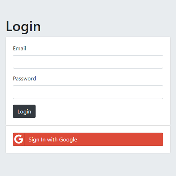

# London App Brewery - Secrets

This is a solution to the [Secrets](https://www.udemy.com/course/the-complete-web-development-bootcamp/learn/lecture/13559376) challenge on [Udemy](https://www.udemy.com/course/the-complete-web-development-bootcamp/).

## Table of contents

- [Overview](#overview)
  - [The challenge](#the-challenge)
  - [Screenshot](#screenshot)
  - [Links](#links)
- [My process](#my-process)
  - [Built with](#built-with)
  - [How to install and run](#how-to-install-and-run)
- [Author](#author)

## Overview

### The challenge

"Learn the various levels of authentication by creating a Secrets web app."

### Screenshot



### Links

- Code URL: [Github](https://github.com/cekstedt/LAB-Secrets)
- Live Site URL: [Render](https://secrets-ybpt.onrender.com)
- Challenge URL: [Udemy](https://www.udemy.com/course/the-complete-web-development-bootcamp/learn/lecture/13559376)

## My process

### Built with

- NodeJS
- Express
- MongoDB
- Mongoose
- EJS
- Passport
- OAuth

### How to install and run

Make sure you have node.js installed.
```
node -v
```

Clone into the repo.
```
git clone https://github.com/cekstedt/LAB-Secrets
```

Navigate into the root project folder and install dependencies.
```
cd LAB-Secrets/
npm install
```

Create a `.env` file and add a `MONGO_DB='insert_variable_here'` variable to it. Its value should be your MongoDB database URI, which will take one of the following two forms:

> #### Local MongoDB Cluster
>
> Make sure you have [MongoDB](https://www.mongodb.com/docs/manual/installation/) installed.
> 
> Start a second terminal session, and run the command `mongod`.
> 
> Now set your `MONGO_DB` variable in your `.env` file to `mongodb://localhost:27017`.

**- OR -**

> #### MongoDB Atlas Cluster
> 
> Follow [this tutorial](https://www.freecodecamp.org/news/get-started-with-mongodb-atlas/) to set up a hosted database on MongoDB Atlas if you haven't already.
> 
> Now set your `MONGO_DB` variable in your `.env` file to `mongodb+srv://{username}:{password}@{mongoDB-subdomain}.mongodb.net`.
> 
> To find your actual connection string:
> - Navigate to your [Atlas Account](www.mongodb.com)
> - Select your database cluster
> - Select the "Connect" button
> - Select the "Connect to you application > Drivers" tab
> - This will provide more specific instructions for connecting to your database from your app, including the connection string.

You will also need to set up your Google OAuth credentials, through which you will get a `CLIENT_ID` and `CLIENT_SECRET` to add to your `.env` file.  
For detailed steps, refer to the [Set up your Google OAuth Credentials](./set_up_your_google_oauth_credentials.md) page.

You will also need to add a `SECRET` variable to your `.env` file. This can be any string you want, but it should be secure, as it will be used to sign all of your users' session cookies.

Lastly, run the command `npm run start` to start the server, then navigate to http://localhost:3000/ (when developing locally).

## Author

- [@cekstedt](https://github.com/cekstedt)