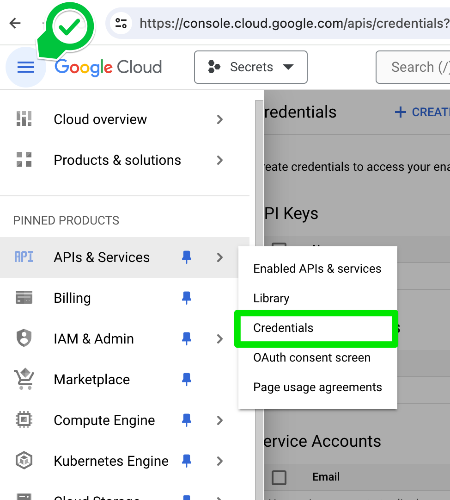
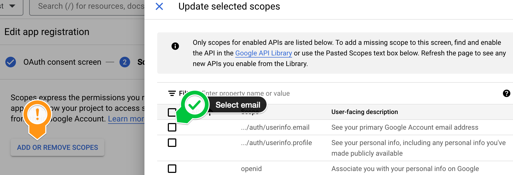
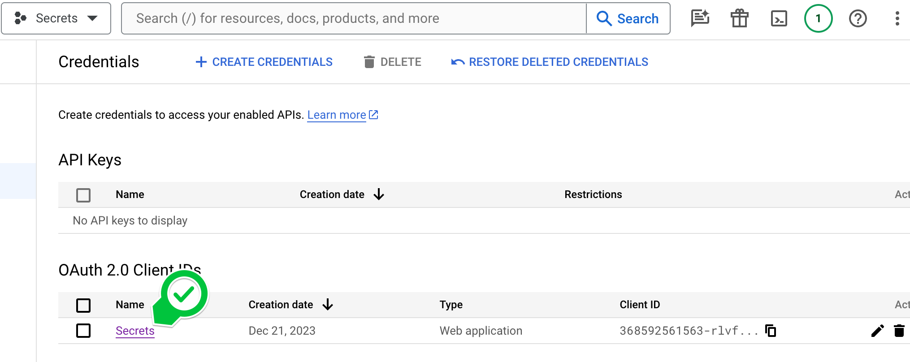
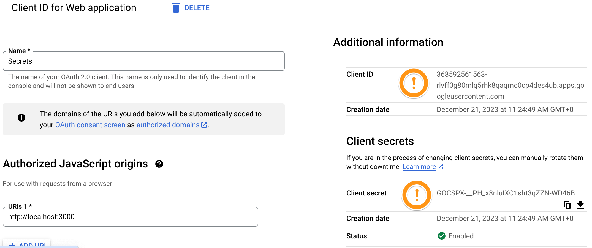

## Set up your Google OAuth Credentials

### Setting up "Login with Google"

In the next lesson, you will create a button that allows users to log into your website using their google account. However, you'll first need to create your own credentials to use in the project (you can't use mine from the video).  

You can use your Google/gmail account for the next steps.  

### Sign in to your google cloud console

Navigate to https://console.cloud.google.com/ and sign in with your Google/gmail account.


### Create a new project


There's a drop down on the top left where you can select a project or create a new one. Create your own project called "Secrets".


You can leave the location as "No organisation".

### Access "Credentials" under APIs & Services

Click on the hamburger menu and navigate to "Credentials".



### Configure Consent Screen

Before you can create your credentials you'll have to configure the consent screen. You'll be prompted to do this when you click "Create OAuth Client ID", but there's also a tab on the side where you can do this right away.


You'll get taken to a form and will have to provide some information about yourself and your app. You're basically configuring the screen that the user sees when they are in the process of granting your app access to their information.


Select "External" for the application type. We be staying in testing mode, so we won't need to go through the verification process for our app.  

Fill in the required information like the app name, the support email, and the developer email addresses. Then click continue. You don't need to provide a domain or logo.


### Configure your Scope

Scopes are the fields that you will receive once the user logs in through google. We're just interested in the email so click on "Add Or Remove Scopes". And add a checkmark:



You don't need to add any test users.

### Create your client ID

Once you're done, navigate back to "Credentials", click "Create Credentials - OAuth client ID.


and choose Web Application

### Add localhost to your Javascript origins

use:
```
http://localhost:3000
```


### Add localhost to your redirect URI

use:
```
http://localhost:3000/auth/google/secrets
```

This is the path where your users are redirected to after they have authenticated with google. You basically want to show your logged in users the secret page, so that's what you need to configure here.


and finally click "Create" to create your client ID.

### Copy your Client ID and Client Secret

Make a note of these two, as you'll need them in the next lesson



